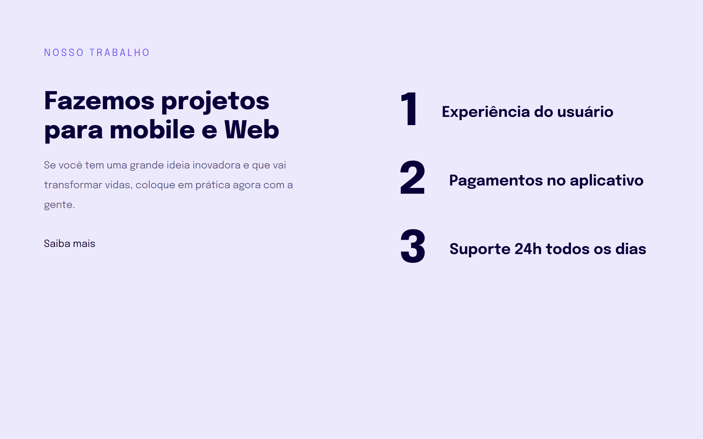

# Explorer Turma 6

> Projeto 04 criado no programa Explorer da RocketSeat

Nesse projeto aprendemos sorbe responsividade e como ajustar a landing page para diferentes resoluções.

## Tecnologias
HTML
CSS

## Contato
daniel.aretakis@hotmail.com